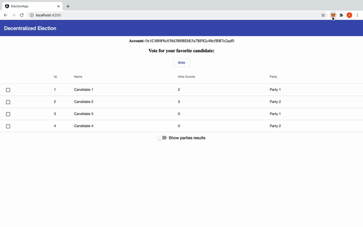

# Election DApp - Sample Ethereum Decentalized Application

## General info
I'm learning how to develop decentralized applications<br/>
This project is a starter Angular DApp where a user can vote for a candidate.
<br/><br/>
A demo application is deployed on Heroku, but a prerequisite to use that is the MetaMask extension.
<br/>
Demo: (https://election-angular-dapp.herokuapp.com/)
<br/>


## Technplogies
* Ethereum.
* Solidity.
* Truffle.
* Angular CLI.
* Angular 11.
* Web 3.
* Typescript
* Javascript
* Chai.js

## Prerequisites
* MetaMask plugin.
* Angular-cli.
* Ganache.

## Installation
### Simple Installation - Ropsten Test Network.
In this way you will use the Smart Contract deployed on Ropsten Test Network.<br/>
So, in MetaMask you have to select the Ropsten Test Network.
1. ```git clone https://github.com/aldomalerba/angular-ethereum-election-dapp.git```.
2. ```cd angular-ethereum-election-dapp```.
3. ```npm install```.
4. ```ng serve```.
### Full Installation - Local Ethereum Envirorment.
First of all you have to run the Ethereum Blockchain locally with Ganache.
In this way you will use the Smart Contract deployed locally.<br/>
So, in MetaMask you have to create a new Custom RPC Network with the settings of the local ethereum blockchain running with ganache and then import a new account (one of ten created by ganache) pasting the account's private key.
1. ```git clone https://github.com/aldomalerba/angular-ethereum-election-dapp.git```.
2. ```cd angular-ethereum-election-dapp```.
3. ```npm install```.
4. ```truffle compile```.
5. ```truffle migrate```.
5. ```ng serve```.

## Donations

ETH: 0xcC73053BFD18227712798ccaF0DD77Afd739e45E